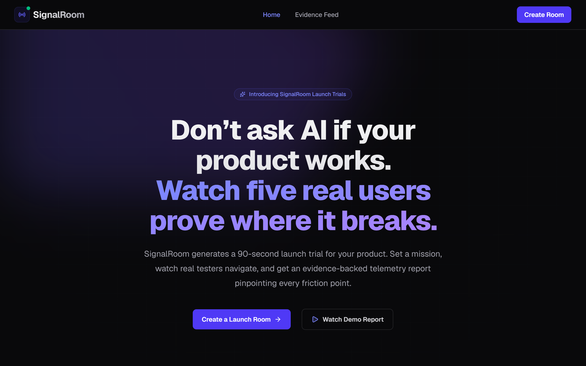
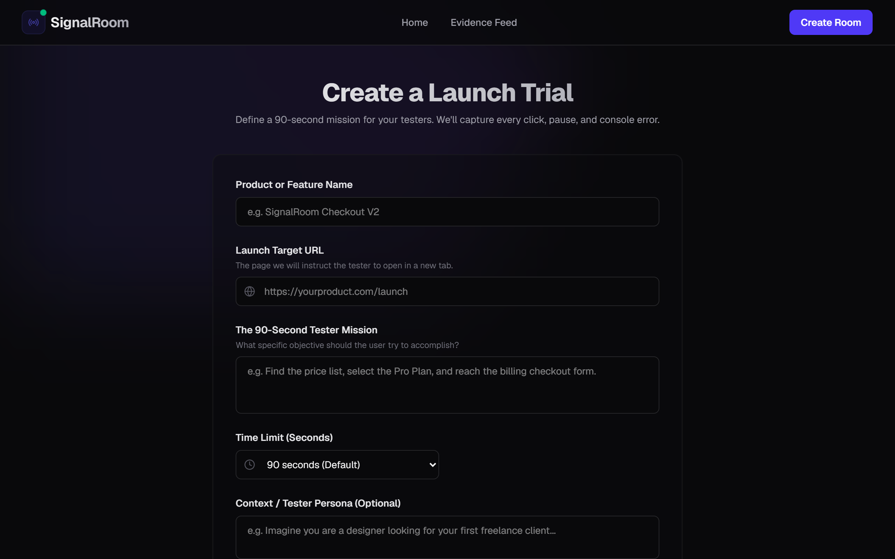
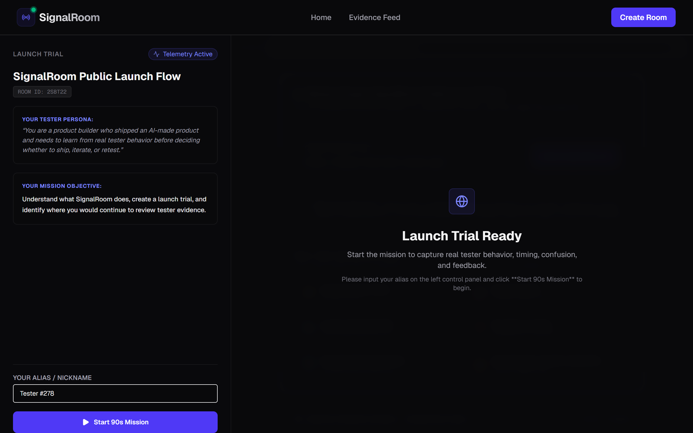
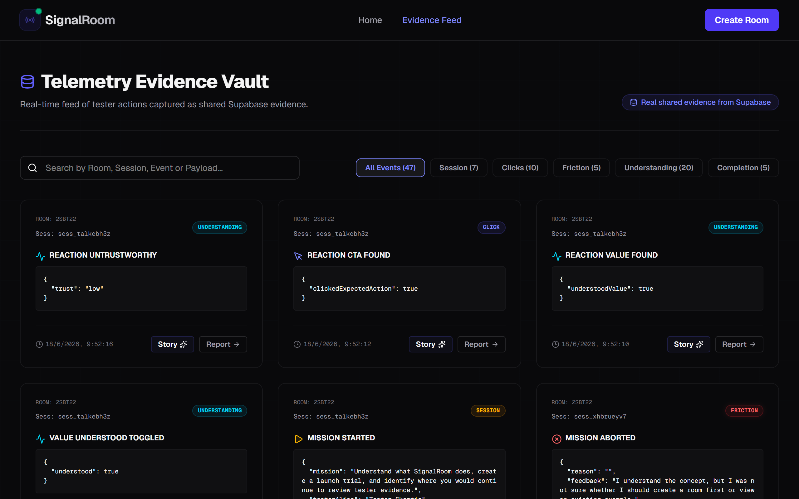
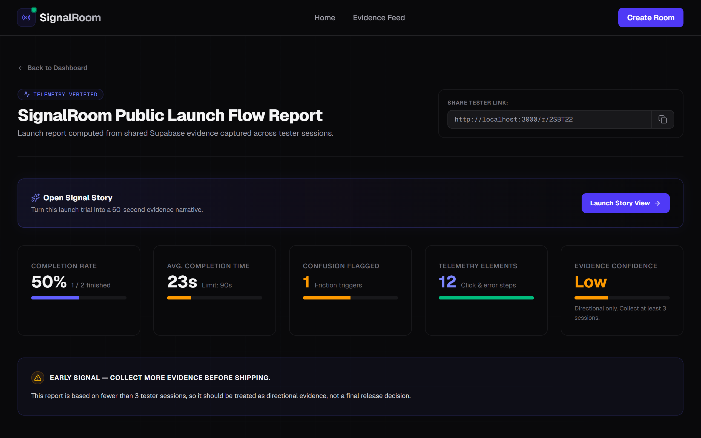
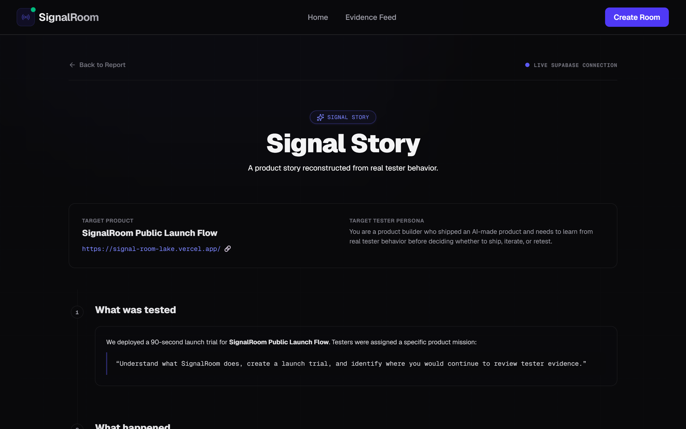
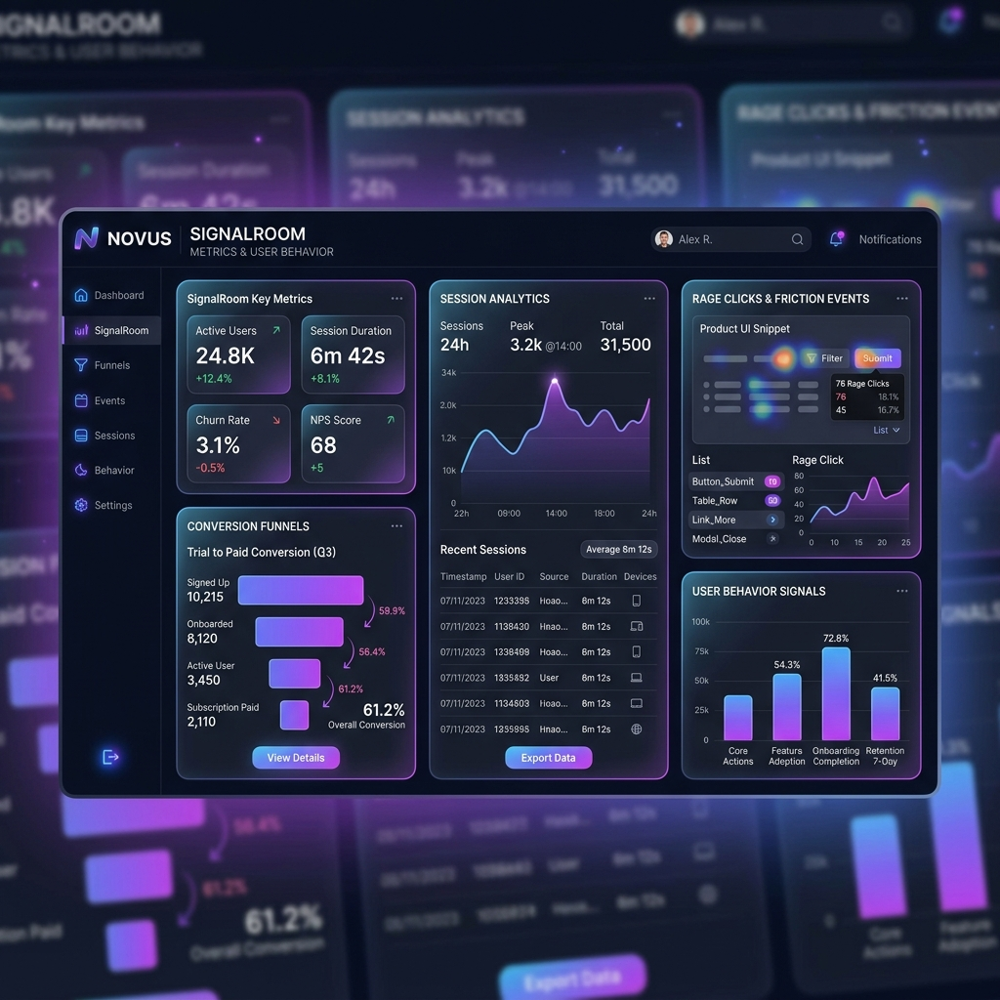
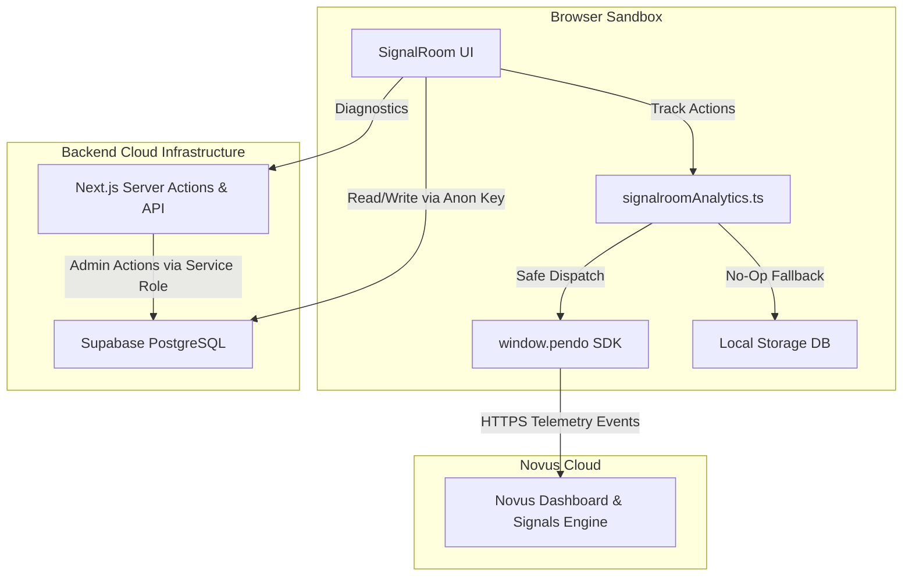
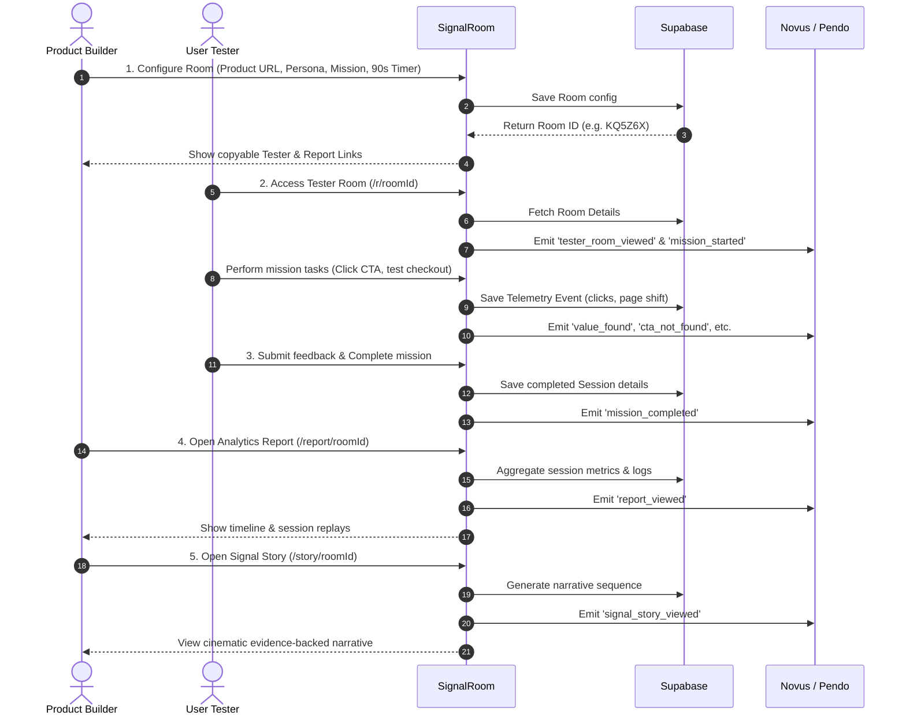
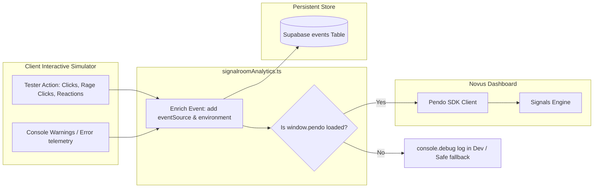

# SignalRoom 🚦

[](https://signal-room-lake.vercel.app/)
[](LICENSE)
[](https://nextjs.org/)
[](https://supabase.com/)
[](https://pendo.io/)

### **“Don’t ask AI if your product works. Watch five real users prove where it breaks.”**

SignalRoom is a high-fidelity usability telemetry environment built for modern product teams and shipped during **Mind the Product World Product Day**. It bridges the gap between shipping code and gaining product confidence by launching 90-second target-driven user trials, capturing micro-interaction friction, and feeding real-time user signals directly into the Novus analytics loop.

🔗 **Live Production Demo**: [https://signal-room-lake.vercel.app/](https://signal-room-lake.vercel.app/)

---

## ⚡ The Problem & The SignalRoom Solution

### **The Problem: The Shipping Trap**
Modern developer velocity has reached escape velocity, but product validation remains slow. Builders launch AI-generated or custom-coded products, only to wait weeks for conversion data or sift through hundreds of unorganized analytics logs. There is no middle ground: it’s either zero data or a firehose of uncontextualized event records.

### **The Solution: SignalRoom**
SignalRoom establishes a high-intent, 90-second usability sandbox. Product managers configure a room with a specific target mission and target URL. Testers execute this target mission in a simulated web viewport. SignalRoom tracks every click, rage click, scroll depth, and console error, translating behavior into a cinematic **Signal Story** and routing clear behavioral trends into **Novus** to trigger product signal alerts.

---

## 🚀 Key Features

* **Instant Room Deployment (`/create`)**: Spawn custom, shareable test rooms with custom targets, tester personas, and time constraints in under 5 seconds.
* **Split-Screen Sandbox (`/r/[roomId]`)**: Display active missions on the left and a live-interaction sandboxed store on the right, equipped with simulated layout shifts and rate-limited APIs.
* **Friction Autopsy Reports (`/report/[roomId]`)**: View aggregated statistics (average completion times, success rates, console error summaries, and rage click counts).
* **Cinematic Signal Story (`/story/[roomId]`)**: Read a narrative reconstruction of tester behavior, identifying exact pivot points where users hit confusion or success.
* **Telemetry Vault (`/evidence`)**: Search and filter global micro-interaction telemetry streams across all active tester sessions.
* **Pendo/Novus Signal Engine**: Safe analytics wrapper client that integrates directly with Pendo to map real-time conversion bottlenecks.

---

## 📸 Product Experience Gallery

Below is a walkthrough of the production SignalRoom experience.

### 🏠 Landing Workspace & Room Setup
The SignalRoom landing page establishes the core value proposition and provides a visual breakdown of how we measure behavioral evidence. Product builders configure target missions in under 5 seconds.

| Home Landing | Create Room |
| :---: | :---: |
|  |  |

---

### 🧪 Tester Portal & Live Console Remote
The Tester Room provides a dual split-screen. The left pane details the mission, countdown timer, and tester reactions console. The right pane provides the simulated target application containing built-in checkout bottlenecks.

| Tester Room | Evidence Telemetry Vault |
| :---: | :---: |
|  |  |

---

### 📊 Friction Autopsy & cinematic Signal Story
Once trials complete, builders inspect structured metric summaries alongside a narrative-backed user journey mapping exactly where and why users succeeded or aborted.

| Product Report | Signal Story Mode |
| :---: | :---: |
|  |  |

---

### 📈 Novus Signals Dashboard
Real-time events (reactions, session abandonment, and checkout completions) flow directly into the Novus dashboard, allowing teams to monitor system signals and product validation status.



---

## ⚙️ Detailed Technical Architecture

SignalRoom is built on **Next.js 15 App Router** using React 19, styled with **Tailwind CSS v4** for high performance, and powered by **Supabase PostgreSQL** for persistent telemetry storage. 



### **1. Core System Components**
* **The Client Sandbox**: Captures client-side rage clicks (multiple clicks in a short window on non-interactive regions) and tracks timing.
* **Safe Analytics Wrapper**: Imports `src/lib/analytics/signalroomAnalytics.ts`. It acts as an abstraction layer over `window.pendo`. If the Novus/Pendo script is blocked by the user's browser, the application continues to run without crashing, falling back to local diagnostics logging.
* **Supabase Bridge**: Direct query layer mapping sessions to unique rooms. If Supabase keys are missing from the configuration, the application transparently degrades to a browser-local database (`localStorage`) to guarantee uptime during local mock trials.

---

## 🔄 Interactive User Workflows

The lifecycle of a product trial spans creation, user execution, data persistence, and analytics delivery:



---

## 🗃️ Telemetry & Evidence Lifecycle

SignalRoom streams micro-interactions asynchronously to both the central evidence database and Pendo's analytics endpoints:



---

## 📊 Database Schema & Data Model

Below is the database structure powering persistent telemetry storage in Supabase PostgreSQL:

```sql
-- 1. Rooms Configuration Table
CREATE TABLE rooms (
  id text PRIMARY KEY,
  product_name text NOT NULL,
  product_url text NOT NULL,
  tester_mission text NOT NULL,
  time_limit_seconds integer NOT NULL DEFAULT 90,
  tester_persona text,
  created_at timestamp with time zone NOT NULL DEFAULT now()
);

-- 2. Tester Sessions Table
CREATE TABLE sessions (
  id text PRIMARY KEY,
  room_id text NOT NULL REFERENCES rooms(id) ON DELETE CASCADE,
  tester_alias text,
  started_at timestamp with time zone NOT NULL DEFAULT now(),
  completed_at timestamp with time zone,
  duration_seconds integer,
  completed_mission boolean NOT NULL DEFAULT false,
  understood_value boolean NOT NULL DEFAULT false,
  found_cta boolean NOT NULL DEFAULT false,
  could_not_find_cta boolean NOT NULL DEFAULT false,
  offer_unclear boolean NOT NULL DEFAULT false,
  page_trustworthy boolean NOT NULL DEFAULT false,
  page_not_trustworthy boolean NOT NULL DEFAULT false,
  confusion_reported boolean NOT NULL DEFAULT false,
  confusion_reason text,
  feedback_text text
);

-- 3. Telemetry Events Stream Table
CREATE TABLE events (
  id text PRIMARY KEY,
  room_id text NOT NULL REFERENCES rooms(id) ON DELETE CASCADE,
  session_id text REFERENCES sessions(id) ON DELETE CASCADE,
  event_name text NOT NULL,
  event_category text NOT NULL DEFAULT 'session',
  event_payload jsonb,
  created_at timestamp with time zone NOT NULL DEFAULT now()
);

-- 4. Analytics Reports Cache Table
CREATE TABLE reports (
  id text PRIMARY KEY,
  room_id text NOT NULL REFERENCES rooms(id) ON DELETE CASCADE,
  summary text,
  metrics_json jsonb NOT NULL,
  recommendations_json jsonb NOT NULL,
  created_at timestamp with time zone NOT NULL DEFAULT now()
);
```

---

## 🎯 The Strategic Role of Novus

### **Why Novus Matters**
Novus is not configured merely to count user clicks. It serves as the primary **signals correlation layer** for SignalRoom. While the internal Supabase tables serve as a detailed, step-by-step telemetry ledger, Novus:
1. **Detects Key Functional Paths**: Automatically aggregates tester sessions to isolate macro-trends (e.g. how many sessions resulted in "Mission Aborted" compared to "Checkout Complete").
2. **Validates Product Learning Loops**: Helps product managers verify whether their telemetry collection works (e.g. by comparing the ratio of client-reported confusion events to dashboard page-view trends).
3. **Generates High-Intent Signals**: By tracking specific custom events like `cta_not_found` or `offer_unclear`, Novus compiles usability signals that warn developers of friction points before production deployment.

### **Signals Observed in Novus**
The SignalRoom integration monitors several key signals:
* **Landing Conversion Friction**: Tracks the ratio of `create_room_viewed` to `room_created` to detect complexity in the creation portal.
* **Room Setup Abandonment**: Identifies drop-offs on room configurations when builders start but do not save a trial workspace.
* **Tester Checkout Fatigue**: Measures the count of `sandbox_checkout_attempted` events against `mission_completed` to capture form friction.
* **Engagement Gaps**: Evaluates when testers navigate to reports (`report_viewed`) but skip reading the cinematic Signal Story (`signal_story_viewed`), identifying opportunities to improve UI summary cards.

---

## 🛠️ Local Development Setup

### **Prerequisites**
* [Node.js v18.17.0+](https://nodejs.org/)
* A [Supabase Account](https://supabase.com/) (or local PostgreSQL instance)

### **1. Install Dependencies**
```bash
npm install
```

### **2. Configure Environment**
Copy the template configuration file:
```bash
cp .env.example .env.local
```
Update `.env.local` with your database credentials:
```bash
NEXT_PUBLIC_APP_URL=http://localhost:3000
NEXT_PUBLIC_SUPABASE_URL=https://<your-project-id>.supabase.co
NEXT_PUBLIC_SUPABASE_ANON_KEY=<your-anon-public-key>
SUPABASE_SERVICE_ROLE_KEY=<your-service-role-key>
```

### **3. Run Development Server**
```bash
npm run dev
```
Access the application at [http://localhost:3000](http://localhost:3000).

### **4. Verify Environment Status**
Verify your local connection status by visiting `/api/health`. You should receive:
```json
{
  "app": "SignalRoom",
  "status": "ok",
  "supabaseConfigured": true,
  "novusInstalled": true,
  "customAnalyticsWrapper": true
}
```

---

## 🚀 Vercel Production Deployment

### **1. Configure Production Environment Variables**
Configure the following environment variables in your Vercel Project Settings:

| Environment Variable | Description |
| :--- | :--- |
| `NEXT_PUBLIC_APP_URL` | Your production URL (e.g. `https://signal-room-lake.vercel.app`). Used client-side for generating sharing assets. |
| `NEXT_PUBLIC_SUPABASE_URL` | The public API access endpoint for your Supabase project. |
| `NEXT_PUBLIC_SUPABASE_ANON_KEY` | The standard public access anonymous token for your Supabase client. |
| `SUPABASE_SERVICE_ROLE_KEY` | The secret service role key. Keep this private; it is restricted to server-side operations only. |

### **2. Build and Deploy**
1. Push your local repository updates to your GitHub account.
2. In the Vercel Dashboard, select **Add New Project** and import the repository.
3. Supply the environment variables and select **Deploy**.
4. Confirm successful database communication post-deployment by querying `https://<your-vercel-domain>/api/health`.

---

## 🚦 Limitations & Technical Scopes

For a complete breakdown of choices and security properties, review the [LIMITATIONS.md](file:///d:/signalroom/LIMITATIONS.md) file:
* **Anonymous Rooms**: There is no authentication layer. Anyone with a copyable URL can view reports or join as a tester.
* **RLS Setup**: Database tables are configured for public select/insert via the Supabase Anon Key to optimize for hackathon trial agility.
* **Cross-Origin Framing**: Target URLs are evaluated using the split-screen Reaction Remote in a separate browser tab to bypass browser iframe CORS block policies.

---

## 🗺️ Product Roadmap & Future Vision

Our roadmap balances scale, deeper telemetry integration, and AI-driven automation:

```
                  HORIZON 1: NEXT                   HORIZON 2: LATER                  HORIZON 3: FUTURE
          ┌───────────────────────────────┐ ┌───────────────────────────────┐ ┌───────────────────────────────┐
          │  • Multi-Room Dashboard       │ │  • Benchmark Library          │ │  • Launch Health Scoring      │
          │  • Team Workspaces            │ │  • Stakeholder Sharing Link   │ │  • AI Recommendation Engine   │
          │  • Event Search Filters       │ │  • Multi-Session Replays      │ │  • Product Memory over Time │
          └───────────────────────────────┘ └───────────────────────────────┘ └───────────────────────────────┘
```

### **Horizon 1: Next (Core Platform Scale)**
* **Multi-Room Workspaces**: Group multiple product URLs and launch trials under a single workspace profile.
* **Custom Event Filters**: Add advanced date-range filters and search queries to the Evidence Feed.
* **Multi-device Testing**: Provide mobile viewport presets within the Tester Room sandbox.

### **Horizon 2: Later (Collaboration & Context)**
* **Shareable Executive Summary Links**: Export encrypted, read-only PDF/HTML reports for external stakeholders.
* **Benchmark Library**: Compare user metrics against average completion records and industry-standard usability percentiles.
* **Session Replay Aggregation**: Synchronize multiple tester playbacks into a single side-by-side view to compare user workflows.

### **Horizon 3: Future (AI & Prediction)**
* **Launch Health Scoring**: Evaluate landing pages and checkout flows, assigning a numeric confidence score (0-100) before public release.
* **AI-Assisted Recommendation Layer**: Analyze timeline logs and suggest specific design changes (e.g. "Move target CTA higher; 60% of testers spent 30 seconds searching for it").
* **Product Memory over Time**: Track multiple product validation iterations, plotting usability improvement trends across design versions.

---

## 📄 License
This project is licensed under the MIT License - see the [LICENSE](LICENSE) file for details.
